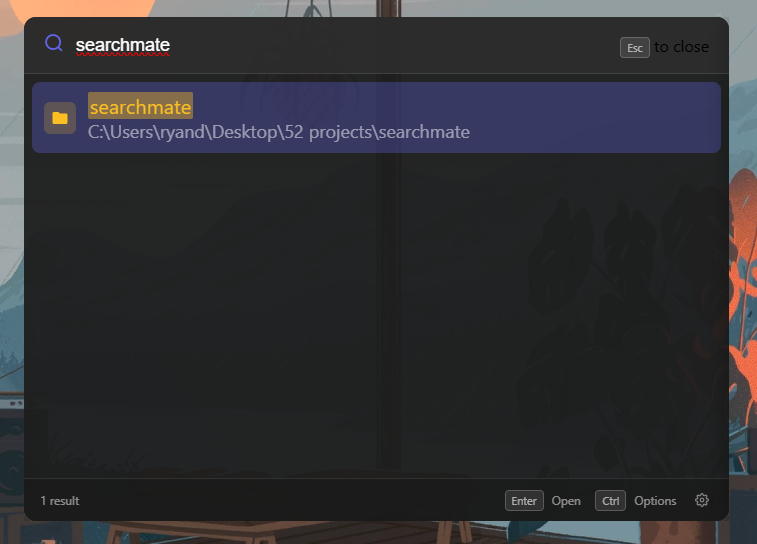

# SearchMate

A fast, lightweight file search app for Windows. Find files instantly with a global hotkey.

## Features

- **Instant Search** - Type and see results immediately
- **Global Hotkey** - Press `Ctrl+Space` from anywhere to open
- **Smart Ranking** - Exact matches, prefixes, and fuzzy matching
- **File Preview** - Preview text files, images, and folder contents
- **Quick Actions** - Open files, folders, VS Code, or terminal with keyboard shortcuts
- **Customizable** - Configure search paths, themes, opacity, and more
- **Portable Option** - Single .exe, no installation required

## Download

Download the latest version from [Releases](../../releases):

| File | Description |
|------|-------------|
| `SearchMate Setup X.X.X.exe` | Installer with shortcuts and uninstaller |
| `SearchMate-X.X.X-portable.exe` | Portable single file, run anywhere |

### Windows Security Note

Windows may show "Windows protected your PC" on first run. This is because the app isn't code-signed yet. Click **More info** → **Run anyway** to proceed.

## Usage

1. Press `Ctrl+Space` to open SearchMate
2. Start typing to search
3. Use `↑` `↓` arrows to navigate results
4. Press `Enter` to open the selected file
5. Press `Escape` to close

### Keyboard Shortcuts

| Key | Action |
|-----|--------|
| `Enter` | Open file/folder |
| `Ctrl+Enter` | Open in VS Code |
| `Ctrl+Shift+Enter` | Open in Terminal |
| `Right Click` or `Menu Key` | Context menu |
| `Escape` | Close window |

### Context Menu Actions

Right-click any result (or press the Menu key) for quick actions:
- Open File/Folder
- Show in Explorer
- Open in VS Code
- Open in Terminal
- Copy Path

## Settings

Click the gear icon to customize:

- **Search Paths** - Directories to index
- **Exclude Patterns** - Skip folders like `node_modules`, `.git`
- **Hotkey** - Change the global shortcut
- **Theme** - Light, Dark, or System
- **Window Position** - Corner, edge, or center
- **Opacity** - Window transparency

## Requirements

- Windows 10/11 (64-bit)

## License

MIT License - see [LICENSE](LICENSE) for details.

## Author

Created by Arash Shalchian
